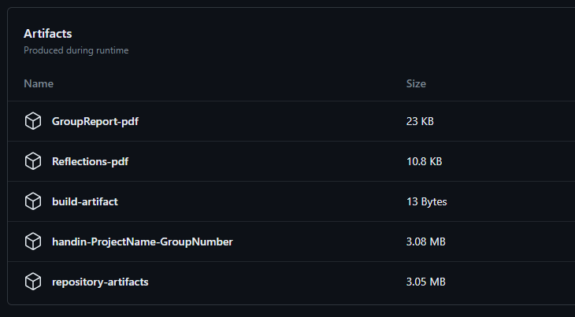

# Advanced Software Engineering Portfolio Template

- [Introduction](#introduction)
- [Structure](#structure)
  - [.github](#github)
    - [CI/CD Workflow](#cicd-workflow)
    - [Hand in Workflow](#hand-in-workflow)
  - [.vscode](#vscode)
  - [Report](#report)
  - [Src](#src)
- [Compiling Latex](#compiling-latex)
  - [Option 1: LaTeX Workshop + TeX Live](#option-1-latex-workshop--tex-live)
    - [Extension](#extension)
    - [Link to download TeX Live](#link-to-download-tex-live)
  - [Option 2: Trigger Task on Save + Docker](#option-2-trigger-task-on-save--docker)
    - [Compilation of latex on save](#compilation-of-latex-on-save)
  - [Option 3: Overleaf](#option-3-overleaf)

## Introduction
This repository serves as a template for students of Advanced Software Engineering to structure their portfolio project.

## Structure
Below is the detailed overview of the structure:

<pre>
.
├── .github/
│   └── workflows/
│       ├── ci-cd.yml
│       └── handin.yml
├── .vscode/
│   ├── settings.json
│   └── tasks.json
├── Report/
│   ├── GroupTemplate/
│   └── ReflectionsTemplate/
├── Src/
└── .gitignore
</pre>

### .github
This folder contains template workflows designed for CI/CD processes and for generating the final submission artifacts.

#### CI/CD Workflow
The CI/CD workflow is split into several jobs:

- **Clone repository**: This job clones the repository, creates an artifact from it, and then uploads this artifact, ensuring consistency across all jobs.
- **Code analysis**: Utilize this job for linting or any other static code analysis tools you'd like to incorporate.
- **Build application**: Compile the source code. After compiling, the artifact is uploaded for easy accessibility, aiding in debugging and local testing.
- **Test application**: Run tests that require the code to be compiled. This step downloads the compiled artifact created in the previous step.
- **Build and push image**: This job builds an image using a specified `DockerFile` and pushes the image to the GitHub container registry specific to the repository owner.
- **Deploy application**: Deploy the image(s) generated during the workflow onto your virtual machines.

#### Hand in Workflow
The hand-in workflow includes some of the jobs from the CI/CD workflow and some additional ones:

- **Compile latex groupReport**: This job compiles the latex source files for the group report and places the output in a hand-in folder.
- **Compile latex groupReport**: This job compiles the latex source files for the reflections document and places the output in a hand-in folder.
- **Upload hand-in artifacts**: This job creates a zip file containing the Group Report, the Reflections Document, the source code, and any build artifacts. The zip can be downloaded by navigating to Repository > Actions > The completed hand-in workflow.



### .vscode
This folder contains a task file and a settings file. These are used to compile latex source files whenever a save action is performed on a `.tex` file. To utilize this feature, use VSCode and ensure you've installed the `Trigger Task on Save` extension.

### Report
This directory contains the latex source files essential for the group report and the reflections document.

### Src
This folder is intended for organizing and storing all your code.

## Compiling Latex
You can compile latex source files to PDF locally. Multiple options are available; choose the one you prefer.

### Option 1: LaTeX Workshop Extension + TeX Live
For this option, you'll need the VSCode extension called LaTeX Workshop and the LaTeX Distribution named TeX Live.

While TeX Live does require 6GB! of space, it is a comprehensive collection of nearly all LaTeX packages, it is very user-friendly when paired with LaTeX Workshop.

#### Extension


#### Link to download TeX Live
[TeX Live Official Download](https://www.tug.org/texlive/)

### Option 2: Trigger Task on Save Extension + Docker
This option requires Docker to be installed and running.

Here's how it works:

Inside the `report` folder, there's a `docker-compose-latex.yml` file.

- This docker-compose file will bind mount the `GroupTemplate` and `ReflectionsTemplate` folders.
- A docker container will start, compile the latex source files, and then exit. The initial process might be time-consuming as it needs to create the image. However, subsequent compilations are faster.

To manually run the `docker-compose-latex.yml`, use the command:

```docker compose -f report/docker-compose-latex.yml up```

To run for a specific latex document i.e `GroupReport` or `Reflections` use these commands:

```docker compose -f report/docker-compose-latex.yml run latex reflection```
or
```docker compose -f report/docker-compose-latex.yml run latex groupreport```

#### Trigger Task on Save Extension
If you're using VSCode, you can set up your latex files to compile upon saving. For this, download the `Trigger Task on Save` extension.


This extension will trigger the task defined in `.vscode/tasks.json` every time you save a `.tex` file. The task will execute the `docker compose -f report/docker-compose-latex.yml up` command.

### Option 3: Overleaf
You are free to import the latex source files into Overleaf.
- If you use this method, you could export the source files from overleaf when done with the report and reflections document.
- By placing the source files into their respective folders `repot/GroupTemplate` and `report/ReflectionsTemplate` you can still take advantage of the handin workflow when creating your final hand in artifact.